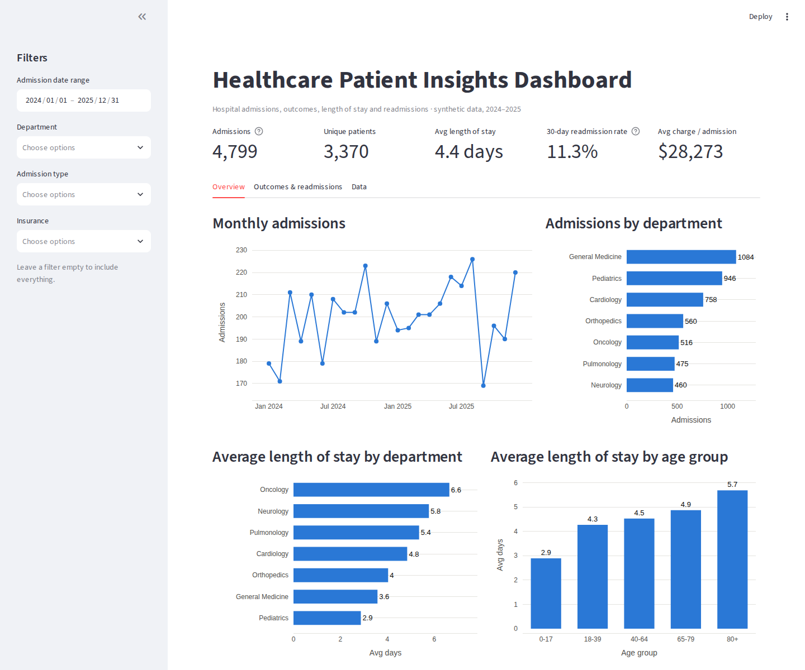
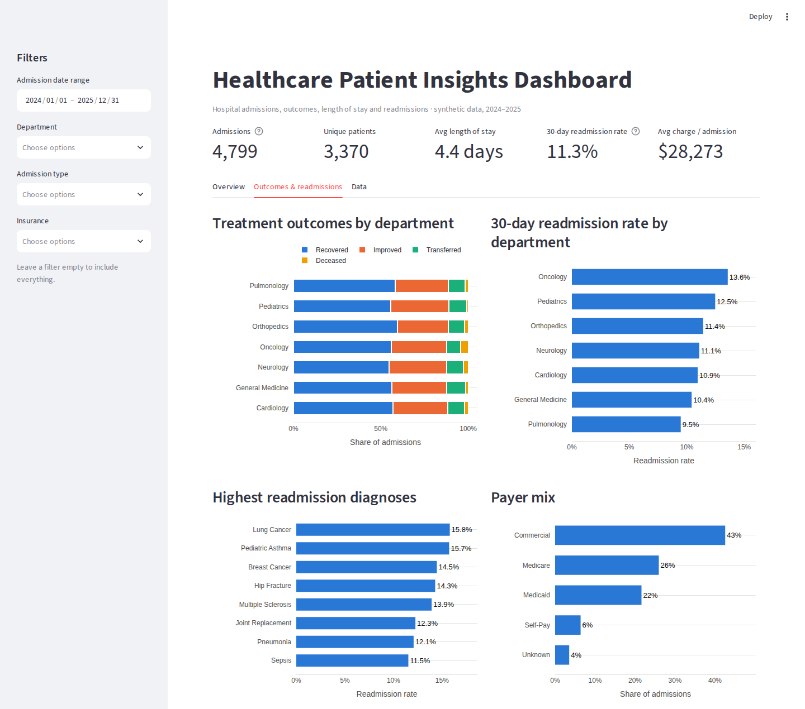

# Healthcare Data Analysis & Patient Insights Dashboard

**Python · SQL · Power BI · Streamlit**

An end-to-end healthcare analytics project: messy hospital admission records are
cleaned and validated in **Python (Pandas)**, modeled into a **SQL star schema**, analyzed with
**SQL KPI queries**, and presented in an **interactive dashboard** tracking patient admissions,
treatment outcomes, length of stay and 30-day readmissions. The same model is
documented for a **Power BI** report (DAX measures, theme and build guide).

> **Data note:** all data is **synthetic**, generated by `src/generate_data.py`. It contains no real
> patient information (no PHI). It is designed to behave like a real hospital extract, with
> realistic patterns and real-world data-quality problems.




---

## What this project shows

| Skill | Where |
|---|---|
| Data cleaning & validation (duplicates, missing values, inconsistent labels, mixed date formats, invalid values) | `src/clean_data.py`, `reports/data_quality_report.md` |
| Feature engineering (length of stay, age groups, 30-day readmission flag) | `src/clean_data.py` |
| Relational modeling (star schema, keys, constraints, indexes) | `sql/schema.sql` |
| SQL analysis (aggregations, joins, CASE, window functions `LEAD` / `SUM() OVER`) | `sql/kpi_queries.sql` |
| Reconciliation of SQL vs. Python logic | `readmission_check` query, `tests/` |
| Interactive dashboard with filters & KPI cards | `app/dashboard.py` |
| Power BI data model & DAX (time intelligence, ranking) | `powerbi/` |
| Automated data-quality tests | `tests/test_data_quality.py` |

## Pipeline

```
generate_data.py      clean_data.py               load_to_sql.py                dashboard.py
 raw CSVs  ───────▶  validated CSVs  ───────▶  SQLite star schema  ───────▶  Streamlit dashboard
 (messy)             + quality report           + KPI query exports            Power BI report
```

## KPIs tracked

* Total admissions & unique patients
* Average length of stay (ALOS), by department and age group
* 30-day readmission rate, by department and diagnosis
* Treatment outcomes (recovered / improved / transferred / deceased) and mortality rate
* Average charge per admission and payer mix

## Data cleaning results

From `reports/data_quality_report.md`:

| Step | Result |
|---|---|
| Exact duplicate rows removed | 25 patients / 60 admissions |
| Department labels standardized | 16 variants → 7 departments |
| Dates converted from MM/DD/YYYY | 743 admission dates |
| Negative charges (sign error) corrected | 14 |
| Discharge before admission removed | 12 |
| Missing charges imputed (department + diagnosis median) | 96 |
| Admissions without a matching patient | 0 |
| **Clean output** | **4,000 patients / 4,799 admissions** |

## Key insights (from this dataset)

* **Oncology** has the longest average stay (**6.6 days**), the highest readmission rate (**13.6%**)
  and the highest average charge (~$59K) — the clearest target for discharge-planning follow-up.
* **Length of stay rises with age**: 2.9 days for patients 0–17 vs. 5.7 days for patients 80+.
* **General Medicine** handles the most admissions (1,084) with a shorter stay (3.6 days), so it drives
  bed volume rather than bed days per patient.
* Overall: **4,799 admissions**, **4.4-day ALOS**, **11.3% 30-day readmission rate**.

## Run it locally

```bash
git clone https://github.com/<your-username>/healthcare-patient-insights-dashboard.git
cd healthcare-patient-insights-dashboard
python -m venv .venv
source .venv/bin/activate          # Windows: .venv\Scripts\activate
pip install -r requirements.txt

python src/run_pipeline.py         # generate → clean → load SQL → export KPIs
streamlit run app/dashboard.py     # opens http://localhost:8501
pytest -q                          # data-quality tests
```

The processed data is committed, so `streamlit run app/dashboard.py` works straight after cloning.

## Power BI

See [`powerbi/POWERBI_GUIDE.md`](powerbi/POWERBI_GUIDE.md) for loading the star schema, the
relationships, report pages and the theme, and [`powerbi/DAX_measures.md`](powerbi/DAX_measures.md)
for the measures (readmission rate, ALOS, YoY, rolling average, ranking).

## Project structure

```
├── app/dashboard.py              # Streamlit + Plotly dashboard
├── src/
│   ├── generate_data.py          # synthetic raw data with realistic quality issues
│   ├── clean_data.py             # cleaning, validation, derived fields
│   ├── load_to_sql.py            # SQLite star schema + KPI exports
│   └── run_pipeline.py           # runs all three
├── sql/
│   ├── schema.sql                # star schema
│   └── kpi_queries.sql           # KPI queries
├── data/raw/                     # messy input
├── data/processed/               # clean CSVs, healthcare.db, kpi_*.csv
├── powerbi/                      # DAX measures, build guide, theme
├── reports/data_quality_report.md
├── tests/test_data_quality.py
└── images/                       # dashboard screenshots
```

## Author

**Slesha Bucchireddy Gari** — M.S. Computer Science, University of Alabama at Birmingham
